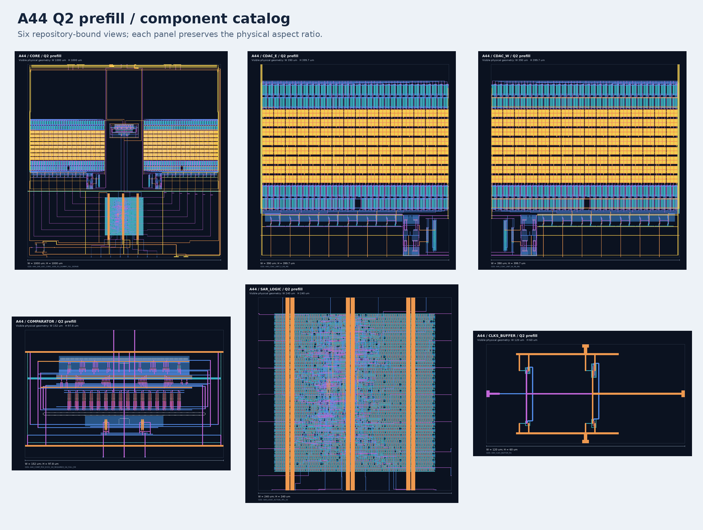
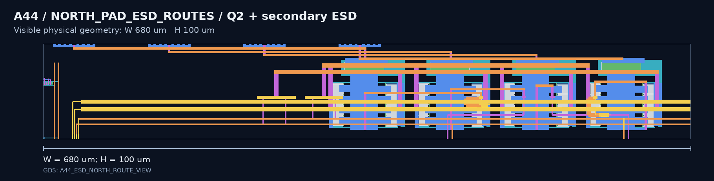

# A44 SAR ADC layout and DEF integration views

The current implementation is `Q2_LINK18_HIER_R1_ANALOG_ESD_R1`.
It contains the `A44_A` project-slot TOP, the Q2 CORE and five component
layouts, and four secondary ESD cells beside the north analog interface.

```text
info.yaml -> lvs_config.json -> gds/A44_A.gds
                           -> verification/a44_q2_analog_esd/spice/A44_A_lvs_reference.spice
```

[Current file bindings](CURRENT_LAYOUT.json) · [Update record](CHANGELOG.md)

## Project interface

| Item | Current implementation |
| --- | --- |
| Top cell | `A44_A` |
| Origin and outline | `(0, 0)` um; `1110 x 1110` um |
| External logical pins | 89 |
| External Metal2 pin rectangles | 127 |
| Pin sides | 85 west; VREFN, VINN, VINP and VREFP north |
| CORE placement | `(55, 55)` um, R0; `1000 x 1000` um |
| Routed DEF units | 1000 per um |
| Native Magic hierarchy | 140 cells |

## Current layout catalog



| Role | GDS top cell | Cell envelope (um) | Visible frame (um) | Image |
| --- | --- | ---: | ---: | --- |
| [TOP](../gds/A44_A.gds) | `A44_A` | 1110 x 1110 | 1055 x 1104.3 | [View](images/q2_analog_esd_20260903/A44_A.png) |
| [CORE](../gds/A44_SAR_ADC_CORE_1000.gds) | `A44_SAR_ADC_CORE_1000_R3_DUMMY_FILL_REPAIR` | 1000 x 1000 | 1000 x 1000 | [View](images/A44_SAR_ADC_CORE_1000.png) |
| [CDAC east](../gds/components/A44_SAR_ADC_CDAC_E_390X399P7.gds) | `A44_CDAC_UNIT_E_R8_M6` | 390 x 399.7 | 390 x 399.7 | [View](images/A44_SAR_ADC_CDAC_E_390X399P7.png) |
| [CDAC west](../gds/components/A44_SAR_ADC_CDAC_W_390X399P7.gds) | `A44_CDAC_UNIT_W_R8_M6` | 390 x 399.7 | 390 x 399.7 | [View](images/A44_SAR_ADC_CDAC_W_390X399P7.png) |
| [Comparator](../gds/components/A44_SAR_ADC_COMPARATOR_168X100.gds) | `A44_COMP_PEX_ECO1_SD_REQUIRED_G6_FULL_R9` | 168 x 100 | 152 x 97.8 | [View](images/A44_SAR_ADC_COMPARATOR_168X100.png) |
| [SAR logic](../gds/components/A44_SAR_ADC_SAR_LOGIC_240X240.gds) | `SAR_LOGIC_ACTUAL_RTL_SS` | 240 x 240 | 240 x 240 | [View](images/A44_SAR_ADC_SAR_LOGIC_240X240.png) |
| [Clock buffer](../gds/components/A44_SAR_ADC_CLKS_BUFFER_120X60.gds) | `A44_CLKS_BUFFER_R1` | 120 x 60 | 120 x 60 | [View](images/A44_SAR_ADC_CLKS_BUFFER_120X60.png) |
| [Secondary ESD](../gds/components/A44_SECONDARY_ESD_M2.gds) | `io_secondary_5p0` | Source envelope 80 x 76 | 79.495 x 75.65 | [View](images/q2_analog_esd_20260903/io_secondary_5p0.png) |

The CDAC interface wrappers retain names `A44_CDAC_UNIT_E_R7` and
`A44_CDAC_UNIT_W_R7`. Each 390 x 609.85 um wrapper contains the updated
390 x 399.7 um R8/M6 implementation. The TOP's visible process-layer frame is
`[0, 5.7]–[1055, 1110]` um; the full project outline is 1110 x 1110 um.

## Analog secondary ESD



Left to right: VREFN, VINN, VINP and VREFP. The cells connect each pad to its
CORE net through one poly resistor and connect the protected side to VDD/GND
diode banks. See the [circuit and source files](../verification/a44_q2_analog_esd).

## File organization

- `../gds/A44_A.gds`, `../gds/A44_SAR_ADC_CORE_1000.gds` and `../gds/components/`: current TOP, CORE and component GDS files.
- `def/`, `lef/` and `mag/`: routed DEF, interface abstracts and native Magic cells.
- `native_sources/A44_A_Q2_BEFORE_ESD.gds`: bundled frozen Q2 source cache used by the unchanged native child cells.
- `images/`: current images; dated directories retain the corresponding rendered source views.
- `CURRENT_LAYOUT.json`, `MODULE_NAMING_MAP.csv` and `NAMING_POLICY.json`: current file, cell-name and dimension mappings.

Open Magic from `layout/mag` so relative GDS cache paths resolve. The edited
parent is represented by paint and instances. Its 134 unchanged native children
use the Q2 GDS cache; the five native ESD cells use
`gds/components/A44_SECONDARY_ESD_M2.gds`.

The [previous GitHub selection](../verification/a44_layout_history/pre_q2_20260903)
retains the files from commit `52275be`.
