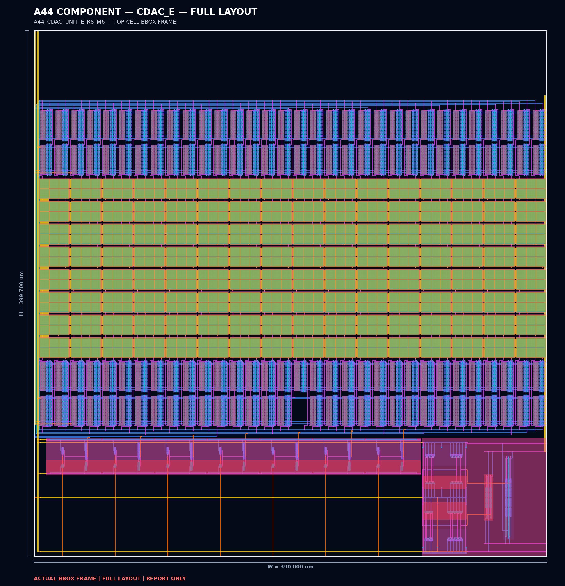
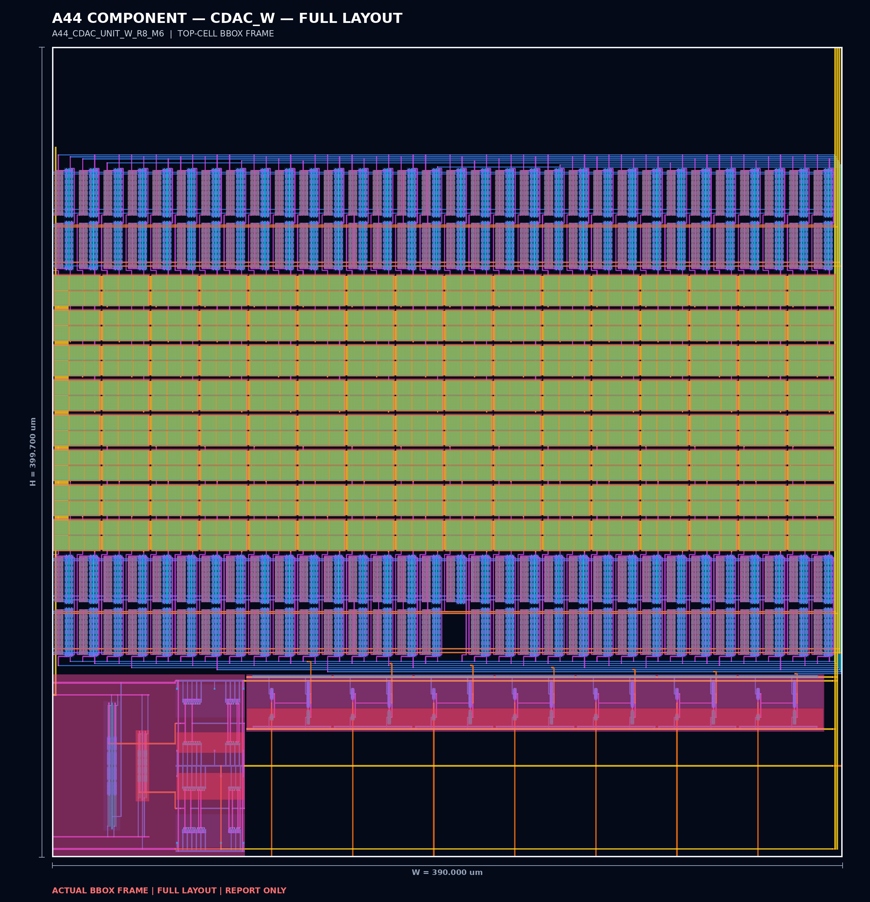

# R8/M6 CDAC layout

Public filenames follow the repository's version-free `A44_SAR_ADC_` naming
style. The verified internal GDS and Magic cell names are retained unchanged.

| Side | Public GDS | Verified internal top | Actual GDS bounding box | Fixed site |
| --- | --- | --- | ---: | ---: |
| East | [`A44_SAR_ADC_CDAC_E.gds`](gds/A44_SAR_ADC_CDAC_E.gds) | `A44_CDAC_UNIT_E_R8_M6` | 389.9 x 399.7 um | 390 x 400 um |
| West | [`A44_SAR_ADC_CDAC_W.gds`](gds/A44_SAR_ADC_CDAC_W.gds) | `A44_CDAC_UNIT_W_R8_M6` | 389.9 x 399.7 um | 390 x 400 um |

Each side contains 768 physical MIM primitives, 2,337 NFETs, 2,337 PFETs,
and 162 extracted nets. The logical mapping contains 127 active switch sites
plus one dummy C1 tied to ground, grouped as 1/2/4/8/16/32/64.

## Verification result

- Native recursive full DRC: zero errors for east and west.
- GDS-readback full DRC: zero errors for east and west.
- Native and readback LVS against the complete current schematic: unique in
  unmerged and conservative extractions.
- Native-to-readback and east-to-west comparisons: unique.
- All 12 recorded LVS comparisons are unique.

The machine-readable evidence is in
[`reports/G3_COMPLETE_UNIT_GATE_RESULT.json`](reports/G3_COMPLETE_UNIT_GATE_RESULT.json)
and
[`reports/CURRENT_VERIFICATION_INDEX.json`](reports/CURRENT_VERIFICATION_INDEX.json).
Native Magic cells and unmerged flat LVS netlists are supplied beside the GDS.

## Final integration

The [current final-integration package](final_integration) includes the exact
post-fill GDS container, the full Magic DRC log, and three complete Netgen LVS
result sets. For the selected
`A44_SAR_ADC_CORE_1000_R3_DUMMY_FILL_REPAIR` cell, Magic `drc(full)` reports
zero errors and all three full-transistor LVS views are unique, property-clean,
and free of black-box options.

The result set uses the selected CORE cell; `chip_top` remains a separate top
cell in the GDS container.

The repository-root submission continues to use its retained CORE, LEF, DEF,
padframe, and full-die bindings.
