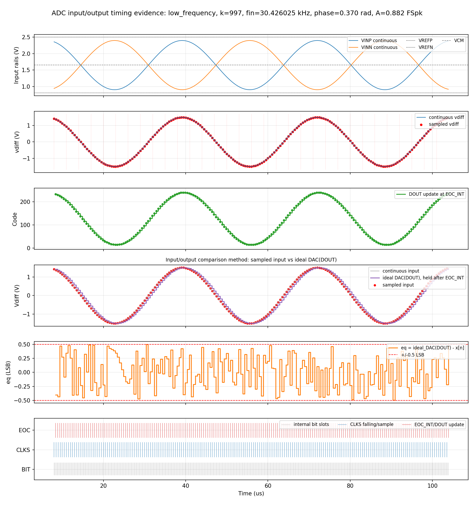
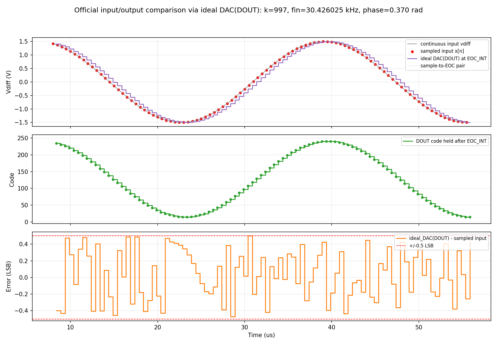
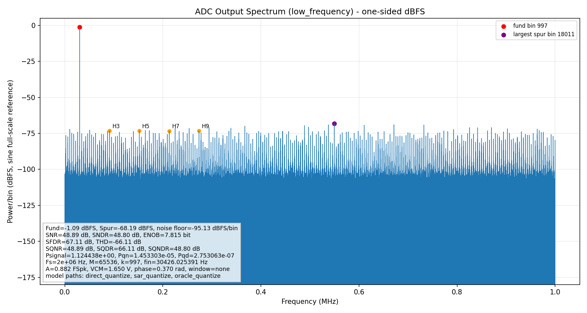
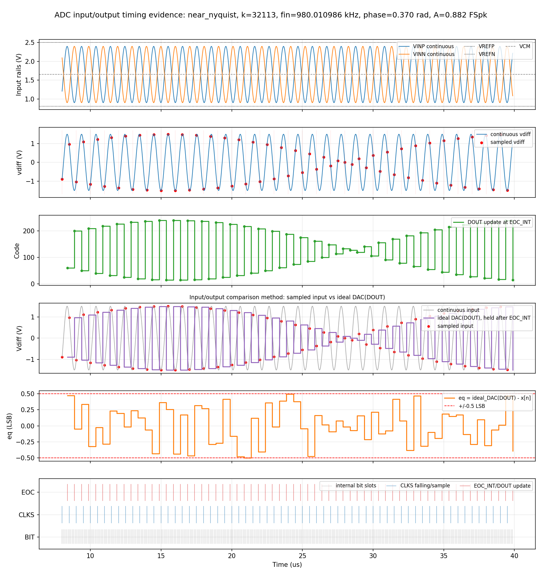
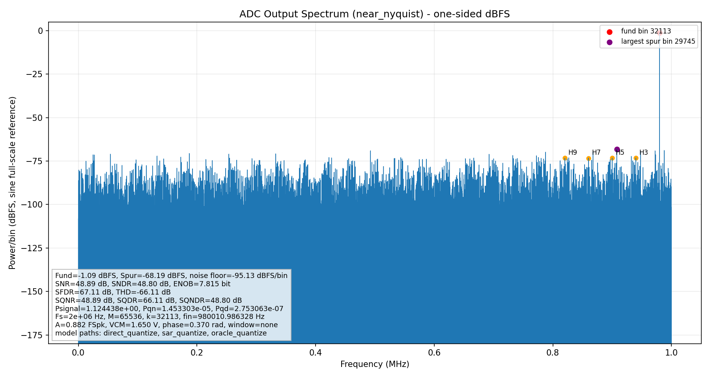

# Ideal SAR ADC/DAC Testbench Validation Report

Generated by `verification/ideal_sar/scripts/run_all.py` from
`verification/ideal_sar/config/sar_adc.yaml`.

## 1. Executive Summary and Go/No-Go Conclusion

Final decision: **GO - testbench validated for schematic phase**.

The Python ideal baseline passes the implemented direct-quantizer, SAR-loop,
DAC, timing, static, dynamic, SQNR/SQDR, and fault-injection checks. The full
specification also requires live `ngspice` plus `cocotb`/HDL simulator execution;
those external paths are available and passing in this environment.

Spec-wide coverage is complete. No blocking or partial coverage items remain in `results/csv/coverage_matrix.csv`.

| Category | Metric | Target | Measured | Status | Evidence |
|---|---|---|---:|---|---|
| Preflight | External core tools | ngspice+cocotb+HDL simulator available | True | PASS | `preflight_tools.csv` |
| Static | DNL | < +/-1 LSB project, <=0.01 LSB ideal | 2.6867397195928788e-14 | PASS | `static_dnl.csv` |
| Static | Endpoint INL | < +/-1.5 LSB project, <=0.01 LSB ideal | 0.0 | PASS | `static_inl.csv` |
| Static | Quantization error RMS | 1/sqrt(12) LSB | 0.2888729004379287 | PASS | `quantization_error_lsb.csv` |
| Dynamic | SNDR worst | >=44 dB | 48.80429130384699 | PASS | `dynamic_metrics.csv` |
| Dynamic | ENOB worst | >=7.0 bit | 7.81466632954269 | PASS | `dynamic_metrics.csv` |
| Dynamic | SQNR total TD baseline | method validation | 48.78590230327425 | PASS | `dynamic_metrics.csv` |
| Dynamic | SQNR spectral baseline | method validation | 48.88579228818422 | PASS | `dynamic_metrics.csv` |
| Dynamic | SQDR baseline | method validation | 66.11119264111052 | PASS | `dynamic_metrics.csv` |
| Dynamic | SQNDR baseline | >=44 dB project via SNDR/SQNDR | 48.80429130384699 | PASS | `dynamic_metrics.csv` |
| Dynamic | SQNR total TD sweep worst | method validation; not project full-scale target | 25.314368453600785 | PASS | `dynamic_sqnr_sqdr_sweep.csv` |
| Dynamic | SQDR sweep worst | method validation; not project full-scale target | 31.690836409855443 | PASS | `dynamic_sqnr_sqdr_sweep.csv` |
| Dynamic | SQNR/SQDR model agreement | <=0.5 dB | 1.2841676095831644e-06 | PASS | `dynamic_sqnr_sqdr_sweep.csv` |
| Dynamic | Input/output waveform low_frequency | CSV rows and multi-panel figure present | 192 rows, fin=30426.025391 Hz | PASS | `adc_input_output_time_low_frequency.csv` |
| Dynamic | Output spectrum low_frequency | 32769 bins for M=65536, no window | fund=-1.0893243059335778 dBFS, fin=30426.025391 Hz | PASS | `adc_output_spectrum_low_frequency.csv` |
| Dynamic | Input/output waveform near_nyquist | CSV rows and multi-panel figure present | 64 rows, fin=980010.986328 Hz | PASS | `adc_input_output_time_near_nyquist.csv` |
| Dynamic | Output spectrum near_nyquist | 32769 bins for M=65536, no window | fund=-1.0893243059335787 dBFS, fin=980010.986328 Hz | PASS | `adc_output_spectrum_near_nyquist.csv` |
| DAC | Low-frequency reconstruction waveform | official waveform comparison method | generated | PASS | `adc_dac_reconstruction_low_frequency.csv` |
| DAC | DAC DNL | <=0.01 LSB ideal | 2.6867397195928788e-14 | PASS | `dac_transfer.csv` |
| Timing | Sample rate | 2 MS/s | 2000000.0 | PASS | `timing_budget.csv` |
| Functional | Direct/SAR/oracle vectors | exact code agreement | 25 | PASS | `functional_vectors.csv` |
| Fault Injection | Negative controls | all detected | 13 | PASS | `fault_injection_results.csv` |
| External | ngspice smoke | PASS | PASS | PASS | `ngspice_smoke.log` |
| External | cocotb smoke | PASS | PASS | PASS | `cocotb_smoke.log` |

## 2. Source Files Read First

See `results/csv/required_input_files.csv`. Missing repository-template files are
recorded as missing instead of inferred.

Project requirements and verification coverage are mapped in
`results/csv/coverage_matrix.csv`.

## 3. Tool Summary

See `results/csv/preflight_tools.csv` and `results/csv/preflight_python_imports.csv`.
`ngspice` smoke: `PASS`.
`cocotb` smoke: `PASS`.

## 4. Configuration and Derived Constants

- bits: `8`
- sample rate: `2e+06 Hz`
- external functional clock: `CLKS = 2e+06 Hz`
- track/conversion window: `125 ns / 375 ns`
- internal bit slots: `8` at `46.875 ns` each
- differential range: `-1.7 V` to `1.7 V`
- `LSB_diff`: `0.01328125 V`
- output encoding: `straight_binary`
- transition tie rule: `upper_code`

## 5. Mathematical Basis

The ideal ADC uses `code = floor((v_diff - v_min)/LSB)` with saturation to
`0..255`. The transition DAC uses `v_min + code*LSB`; the reconstruction DAC
uses `v_min + (code+0.5)*LSB`. The ideal full-scale SQNR estimate used for
plausibility is `6.02*N + 1.76 + 20*log10(A_FS_peak)`.

## 6. Model Independence

Three paths are checked: direct Python quantization, cycle-accurate Python SAR
bit trials, and an independent scalar-loop oracle. Agreement is measured in
`results/csv/functional_vectors.csv` and `results/csv/dynamic_sqnr_sqdr_sweep.csv`.

## 7. Functional and Interface Results

Functional status: `PASS`.
The vector set covers saturation, zero-scale, transition ties, code centers,
and common-mode invariance.

## 8. SAR Timing and Throughput

Timing status: `PASS`.
Nominal throughput is `2000000.0` Hz.
Bit-trial traces are saved in `results/csv/sar_bit_trial_trace.csv`.

## 9. Static ADC Results

- max abs DNL: `2.6867397195928788e-14` LSB
- max abs endpoint INL: `0.0` LSB
- max abs best-fit INL: `7.105427357601002e-14` LSB
- quantization-error RMS: `0.2888729004379287` LSB
- missing-code count: `0`

Figures: `transfer_curve.png`, `transition_error.png`, `dnl.png`,
`inl_endpoint_bestfit.png`, `ramp_histogram.png`, `sine_histogram.png`,
`quantization_error_histogram.png`.

## 10. Histogram Validation

Ramp histogram counts are exactly generated from one code-center value repeated
per code. The sine histogram uses a coherent sine stimulus and is saved for
distribution sanity checking, not as a hidden replacement for deterministic
transition/DNL measurement.

## 11. DAC/CDAC Results

- max abs DAC DNL: `2.6867397195928788e-14` LSB
- max abs DAC INL: `0.0` LSB
- bit-weight max error: `7.105427357601002e-15` LSB

Evidence: `results/csv/dac_transfer.csv`, `results/csv/dac_bit_weights.csv`.

## 12. ADC Dynamic-Performance Results

Representative input/output waveforms and output spectra are embedded first so
reviewers can inspect the actual sampled input, EOC_INT-updated output code,
the official ideal-DAC reconstructed output waveform used for input/output comparison,
quantization error, and one-sided dBFS FFT before
reading the aggregate table.

Representative stimulus setup: amplitude `0.8823529411764706` FS peak,
phase `0.37` rad, window `none`, FFT record length
`65536`, startup discard
`16` conversions.

| Case | k | fin (Hz) | Display samples | Time CSV | Spectrum CSV |
|---|---:|---:|---:|---|---|
| low_frequency | 997 | 30426.025391 | 192 | `results/csv/adc_input_output_time_low_frequency.csv` | `results/csv/adc_output_spectrum_low_frequency.csv` |
| near_nyquist | 32113 | 980010.986328 | 64 | `results/csv/adc_input_output_time_near_nyquist.csv` | `results/csv/adc_output_spectrum_near_nyquist.csv` |

- worst SNDR: `48.80429130384699` dB
- worst ENOB: `7.81466632954269` bit
- baseline SQNR_total,TD at configured FS peak: `48.78590230327425` dB
- baseline SQNR_spectral at configured FS peak: `48.88579228818422` dB
- baseline SQDR at configured FS peak: `66.11119264111052` dB
- baseline SQNDR at configured FS peak: `48.80429130384699` dB
- sweep-worst SQNR_total,TD across amplitudes/phases: `25.314368453600785` dB
- sweep-worst SQNR_spectral across amplitudes/phases: `26.813277724659695` dB
- sweep-worst SQDR across amplitudes/phases: `31.690836409855443` dB
- max model delta: `1.2841676095831644e-06` dB
- theory at configured amplitude: `48.83284675354814` dB

Power partitions are stored in `results/metrics.json`; summary rows are in
`results/csv/dynamic_metrics.csv` and `results/csv/dynamic_sqnr_sqdr_sweep.csv`.
The plotted time-domain source CSV files are
`results/csv/adc_input_output_time_low_frequency.csv` and
`results/csv/adc_input_output_time_near_nyquist.csv`; they include
`sample_index`, `t_sample_s`, `t_eoc_s`, `vinp_v`, `vinn_v`, `vdiff_v`,
`code_decimal`, `code_hex`, `ideal_dac_output_vdiff_v`, `reconstructed_vdiff_v`,
`quantization_error_v`, `quantization_error_lsb`, `clks_falling_sample`, and `eoc_int`.
The official input/output waveform comparison method is to convert EOC_INT-updated
`DOUT` through the ideal reconstruction DAC and compare `ideal_DAC(DOUT)` with
the matching sampled input `x[n]`. The comparison panel plots the continuous
input and sampled input on the original sample-time axis, then plots
`ideal_DAC(DOUT)` at the EOC_INT time so each staircase update follows the sampled
input and holds until the next output. For clearer DAC input/output
correspondence, `results/csv/adc_dac_reconstruction_low_frequency.csv` and
`results/plots/adc_dac_reconstruction_low_frequency.png` use only the
low-frequency representative tone and show sampled input, EOC_INT-updated code,
ideal DAC(DOUT), and quantization error together.
The plotted spectrum source CSV files are
`results/csv/adc_output_spectrum_low_frequency.csv` and
`results/csv/adc_output_spectrum_near_nyquist.csv`; each row is one FFT bin
with frequency, linear power, dBFS power, classification, harmonic order,
fundamental flag, and largest-spur flag.

## 13. SQNR, SQDR, SQNDR Definitions

`SQNR_total,TD` is measured from time-domain quantization error. `SQNR_spectral`
uses fundamental power divided by nonharmonic quantization-noise power. `SQDR`
uses fundamental power divided by folded 2nd-through-Hth harmonic power.
`SQNDR` obeys the linear power closure
`10^(-SQNDR/10)=10^(-SQNR/10)+10^(-SQDR/10)`.

## 14. Power-Measurement Chain Self-Test

The power harness is a synthetic measurement-chain self-test only; it is not a
SAR ADC power claim. Status: `PASS`.

## 15. Fault Injection and Negative Controls

Fault injection status: `PASS`. Detailed rows are in
`results/csv/fault_injection_results.csv`. The set covers offset, gain error,
single-code DNL distortion, missing code, tie-rule error, known harmonic, known
white noise, EOC_INT/timing faults, DOUT bit swap, SAR bit-order error, DAC weight
error, and combined noise plus harmonic closure.

## 16. Raw Data and Traceability

Raw dynamic code streams and quantization-error data are in `results/raw/`.
Machine-readable summaries are `results/metrics.json` and `results/csv/metrics.csv`.
All plots are under `results/plots/`.

## 17. Pass/Fail Criteria

Ideal static criteria use `<=0.01 LSB` for deterministic DNL/INL. Project
dynamic criteria use `SNDR >=44 dB` and `ENOB >=7.0 bit`. SQNR/SQDR pass/fail is
based on agreement among the direct quantizer, SAR path, and independent oracle,
plus theory plausibility for the time-domain quantization-error metric.

## 18. Limitations and Next Steps

This phase is ideal only. It does not validate GF180 devices, transistor-level
sampler/comparator/CDAC behavior, post-layout parasitics, or SAR ADC power.
The Chipathon container execution is the authoritative GO evidence for this ideal phase. Before schematic handoff, rerun the container command and confirm `results/logs/run_all_container.log` still ends with `go_no_go: GO` and `EXIT_CODE=0`.

## 19. Evidence Index

- `results/csv/metrics.csv`
- `results/README.md`
- `results/README.zh-CN.md`
- `results/csv/coverage_matrix.csv`
- `results/metrics.json`
- `results/csv/preflight_tools.csv`
- `results/csv/functional_vectors.csv`
- `results/csv/timing_budget.csv`
- `results/csv/static_dnl.csv`
- `results/csv/static_inl.csv`
- `results/csv/dynamic_metrics.csv`
- `results/csv/dynamic_sqnr_sqdr_sweep.csv`
- `results/csv/adc_input_output_time_low_frequency.csv`
- `results/csv/adc_input_output_time_near_nyquist.csv`
- `results/csv/adc_output_spectrum_low_frequency.csv`
- `results/csv/adc_output_spectrum_near_nyquist.csv`
- `results/csv/dac_transfer.csv`
- `results/csv/fault_injection_results.csv`
- `results/plots/`
